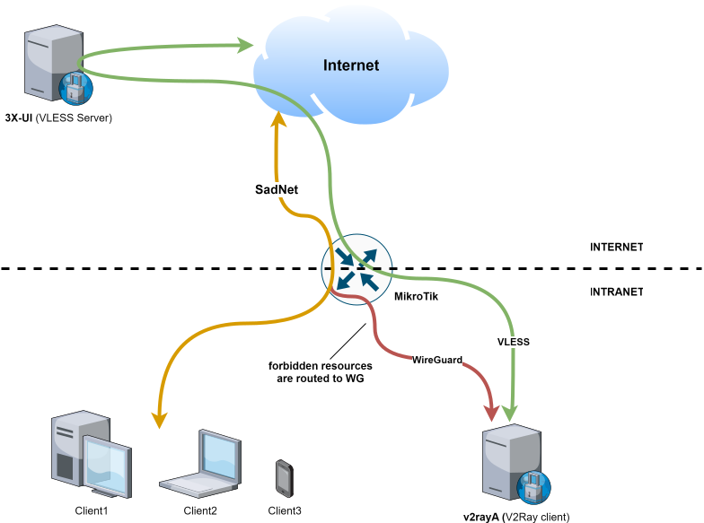

# 🚀 Mikrotik → WireGuard → VLESS

**Selective URL redirection via VLESS on Mikrotik without container support.**



---

## 📑 Table of Contents

- [📋 Requirements](#-requirements)  
- [🛠 Setup within Your Intranet](#-setup-within-your-intranet)  
  - [1. Create a VM with V2rayA and WireGuard](#1-create-a-vm-with-v2raya-and-wireguard)  
    - [1.1. Deploy the VM](#11-deploy-the-vm)  
    - [1.2. Install Docker](#12-install-docker)  
    - [1.3. Run V2rayA Container (Docker Compose)](#13-run-v2raya-container-docker-compose)  
    - [1.4. Run wg-easy Container (Docker Compose)](#14-run-wg-easy-container-docker-compose)  
  - [2. ⚙️ Configure V2rayA](#2️-configure-v2raya)  
  - [3. 🔑 Configure WireGuard](#3️-configure-wireguard)  
  - [4. 📡 Configure Mikrotik](#4️-configure-mikrotik)  
- [✅ Done!](#-done)  

---

## 📋 Requirements

- **3X-UI** running on a Linux VM with a **public IP address** located **outside your country**.

---

## 🛠 Setup within Your Intranet

### 1. Create a VM with V2rayA and WireGuard

#### 1.1. Deploy the VM

- Use **Oracle Linux 9** (recommended).  
- Disable **SELinux** and **Firewalld** during setup — it will likely save you time.

#### 1.2. Install Docker

Follow the [official Docker installation guide for RHEL](https://docs.docker.com/engine/install/rhel/).

#### 1.3. Run **V2rayA** Container (Docker Compose)

<details>
<summary><code>v2raya_docker-compose.yaml</code></summary>

```yaml
services:
  v2raya:
    restart: always
    privileged: true
    network_mode: host
    container_name: v2raya
    environment:
      - V2RAYA_V2RAY_BIN=/usr/local/bin/xray
      - V2RAYA_LOG_FILE=/tmp/v2raya.log
      - V2RAYA_NFTABLES_SUPPORT=off
      - IPTABLES_MODE=legacy
      - V2RAYA_VERBOSE=true
    volumes:
      - '/etc/v2raya:/etc/v2raya'
      - '/etc/resolv.conf:/etc/resolv.conf'
      - '/lib/modules:/lib/modules:ro'
    image: 'mzz2017/v2raya:latest'
```

</details>

#### 1.4. Run **wg-easy** Container (Docker Compose)

<details>
<summary><code>wg-easy_docker-compose.yaml</code></summary>

```yaml
volumes:
  etc_wireguard:

services:
  wg-easy:
    environment:
      - LANG=en
      - WG_HOST=192.168.88.112
      # Optional settings:
      # - PASSWORD_HASH=$$2y$$10$$...   # bcrypt hash (see docs)
      # - PORT=51821
      # - WG_PORT=51820
      # - WG_DEFAULT_DNS=1.1.1.1
      # - UI_TRAFFIC_STATS=true

    image: ghcr.io/wg-easy/wg-easy
    container_name: wg-easy
    volumes:
      - etc_wireguard:/etc/wireguard
    ports:
      - "51820:51820/udp"
      - "51821:51821/tcp"
    restart: unless-stopped
    cap_add:
      - NET_ADMIN
      - SYS_MODULE
    sysctls:
      - net.ipv4.ip_forward=1
      - net.ipv4.conf.all.src_valid_mark=1
```

</details>

---

### 2. ⚙️ Configure V2rayA

1. Open `http://<VM-IP>:2017`.
2. Import the config from **3X-UI** and start the proxy.
3. In **Settings**:
   - ✅ Transparent Proxy/System Proxy → **On (no split traffic)**
   - ✅ IP Forward → **Active**
   - ✅ Port Sharing → **Active**
   - ✅ Transparent Proxy/System Proxy Implementation → **Redirect**
   - ✅ Traffic Splitting Mode of Rule Port → **RoutingA**  
     - Configure → keep only: `default: proxy`
4. Save & Apply.

---

### 3. 🔑 Configure WireGuard

1. Open `http://<VM-IP>:51821`.
2. Click `+ New`, set a name, and create a client.
3. Download the generated config file.

---

### 4. 📡 Configure Mikrotik

1. Upgrade **RouterOS** to version **7.5+** (latest stable recommended).
2. Go to **WireGuard** → `WG Import` → select the downloaded config.
3. In **Peers**:  
   - Set `Endpoint` → `<VM-IP>`  
   - Set `Endpoint port` → `51820`
4. Add NAT rule:

   ```bash
   /ip firewall nat add action=masquerade chain=srcnat out-interface=wg0
   ```

5. Add WireGuard address:

   ```bash
   /ip address add address=<Client-WG-IP/CIDR> interface=wg0 network=<WG-Network>
   ```

   Example:

   ```bash
   /ip address add address=10.8.0.2/24 interface=wg0 network=10.8.0.0
   ```

6. Configure routing:

   ```bash
   /routing table add disabled=no fib name=to-proxy
   /ip route add comment=vpn disabled=no distance=1 dst-address=0.0.0.0/0 gateway=wg0 routing-table=to-proxy
   ```

7. Mark routing for selected domains:

   ```bash
   /ip firewall mangle add action=mark-routing chain=prerouting dst-address-list=vpn-domains new-routing-mark=to-proxy passthrough=yes
   ```

8. Add domains to **DNS static list** for proxy forwarding:  
   - One by one:

     ```bash
     /ip dns static add name=terraform.io type=FWD forward-to=8.8.8.8 address-list=vpn-domains match-subdomain=yes
     ```

   - Or bulk import:

     ```bash
     wget -qO- https://raw.githubusercontent.com/itdoginfo/allow-domains/main/Russia/inside-raw.lst      | sed "s/.*/\/ip dns static add name=& type=FWD forward-to=8.8.8.8 address-list=vpn-domains match-subdomain=yes/"
     ```

     Then paste into terminal.
     
9. ***Extra*** Add routing rules for CIDR blocs or IPs:
   ```bash
   /routing rule add dst-address=91.108.56.0/22 action=lookup table=to-proxy
   ```
---

## ✅ Done!

Now your Mikrotik routes selected domains through VLESS via WireGuard 🎉
